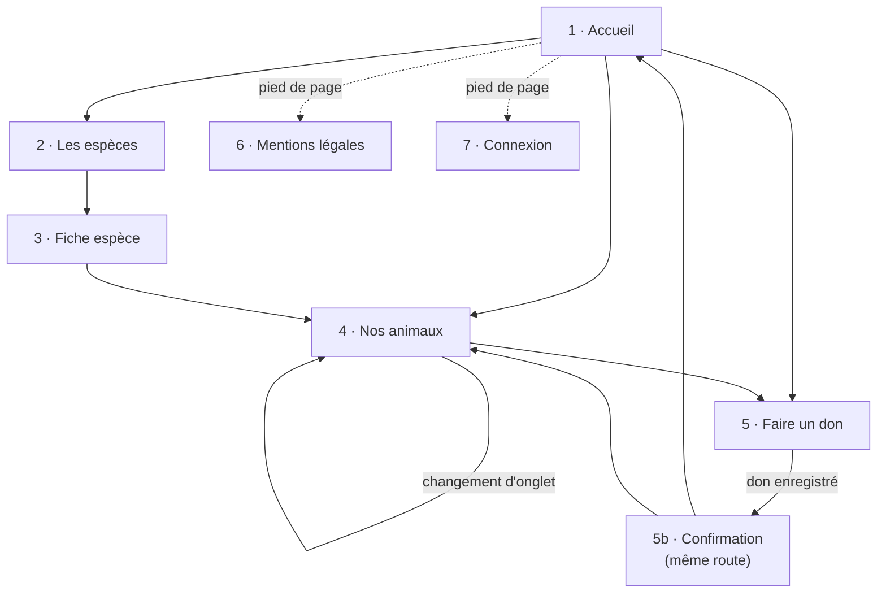
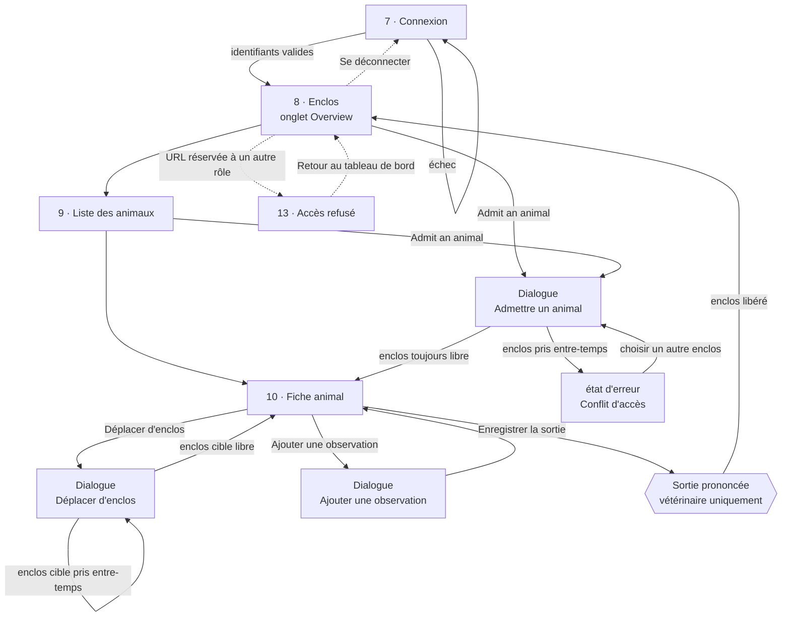
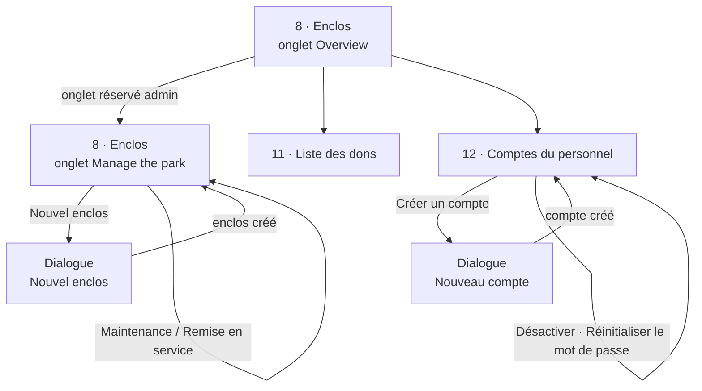
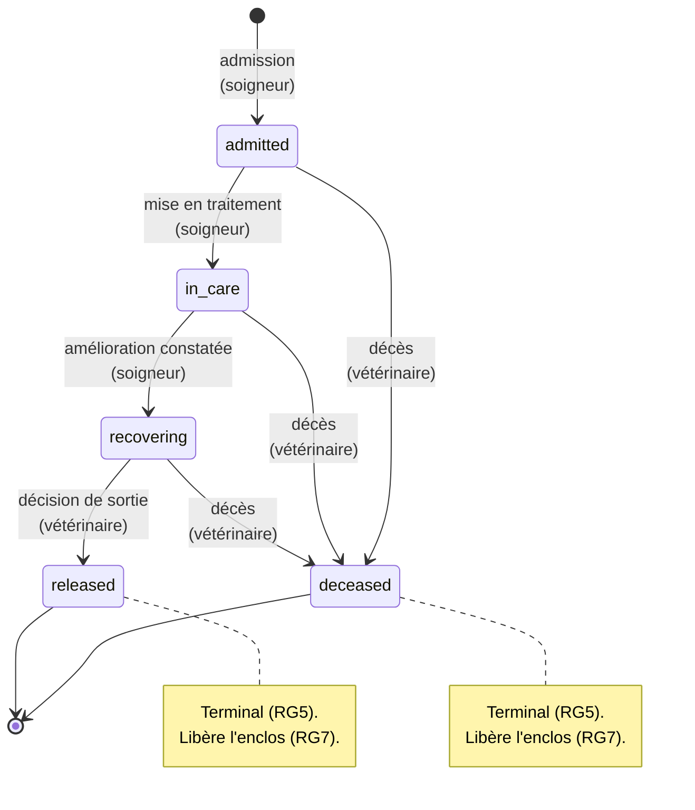

# Arborescence et enchaînement des écrans — Centre Khulula

| | |
|---|---|
| **Version** | 1.8 — 28 août 2026 |
| **Maquettes** | `maquettes/prototype.html` |
| **Couvre** | CP 5 — *« L'enchaînement des maquettes est formalisé par un schéma »* |

---

## 1. Liste des écrans

13 écrans : 6 publics, 7 réservés au personnel.

### Site public — sans compte

| N° | Écran | Besoin | Contenu |
|---|---|---|---|
| 1 | Accueil | V1 | Mission, chiffres clés, animaux en cours de soin |
| 2 | Les espèces | V2 | Liste paginée et filtrable |
| 3 | Fiche espèce | V2 | Détail d'une espèce + ses animaux |
| 4 | Nos animaux | V3, V4 | Liste filtrée : *en soins* / *relâchés* |
| 5 | Faire un don | V5 | Formulaire anonyme, puis accusé d'enregistrement |
| 6 | Mentions légales | V6 | Mentions légales, confidentialité, accessibilité |

### Espace personnel — authentification requise

| N° | Écran | Besoin | Rôle |
|---|---|---|---|
| 7 | Connexion | S1 | — |
| 8 | Enclos — tableau de bord, parc, admission | S2, S3, S4, A2 | Onglet *Overview* : tout le personnel · Onglet *Manage* : administrateur |
| 9 | Liste des animaux | S7 | Soigneur, Vétérinaire |
| 10 | Fiche animal | S5, S6, S7, T1 | Soigneur, Vétérinaire *(sortie : vétérinaire seul)* |
| 11 | Liste des dons | A3 | Administrateur |
| 12 | Comptes du personnel | A1 | Administrateur |
| 13 | Accès refusé / erreur | — | Tout le personnel |

### Quatre écrans portent plusieurs états

Un besoin fonctionnel n'impose pas une page. Le prototype montre chaque état, mais aucun ne
consomme un numéro d'écran.

| Écran | États regroupés | Pourquoi un seul écran |
|---|---|---|
| **1 · Accueil** | Présentation + mission | La mission tient en un paragraphe. |
| **4 · Nos animaux** | *En soins* / *Relâchés* | Même liste, même requête, un seul filtre qui change. |
| **5 · Faire un don** | Formulaire → confirmation | La confirmation est le retour de la même route. |
| **8 · Enclos** | Tableau de bord + parc + admission + conflit d'accès | Une seule ressource pour trois usages. L'admission est une boîte de dialogue, le conflit d'accès son état d'erreur. |

Le filtre de l'écran 4 n'exige aucun champ supplémentaire : il s'appuie sur `animal.status`, qui
existe déjà pour porter le cycle de vie (RG4).

| Onglet | Filtre |
|---|---|
| *In our care* | `status IN ('admitted', 'in_care', 'recovering')` |
| *Released* | `status = 'released'` |

Le statut `deceased` n'est **jamais** exposé publiquement : le centre communique sur son action,
pas sur ses échecs individuels.

**Le conflit d'accès n'est pas un écran**, c'est l'état d'erreur de la boîte d'admission quand
l'enclos choisi a été pris entre son ouverture et sa soumission. La boîte ne se ferme pas et les
données saisies restent en place : la transaction a été annulée, l'utilisateur ne perd rien.
Il matérialise le critère CP 8 *« les conflits d'accès aux données sont gérés »*.

**Les cartes animal ne sont pas cliquables.** Il n'existe pas de page animal publique : l'écran 10
porte le lieu de découverte, le code d'enclos, les observations médicales et les noms du personnel,
que RG11 interdit d'exposer. *Conséquence RGAA :* une carte non cliquable ne doit pas non plus
**paraître** cliquable — pas de curseur `pointer`, pas d'effet de survol, pas d'accès par Tab.

**L'écran 13** regroupe trois états d'une même page : accès refusé (403), page introuvable (404),
session expirée. Il répond à l'exigence §6.1 *« aucun message d'erreur technique renvoyé au
client »*.

### Recherche et pagination

Cinq listes sont paginées (§6.4) ; l'inventaire des enclos ne l'est pas, son volume étant borné
par le centre. **Deux écrans seulement portent une recherche**, ceux où l'on vient chercher un
élément nommé.

| Écran | Pagination | Recherche / filtres |
|---|---|---|
| 2 · Les espèces | ✔ | — |
| 4 · Nos animaux | ✔ | onglets *In our care* / *Released* |
| 8 · Enclos *(Manage)* | — | — |
| 9 · Liste des animaux | ✔ | **statut · espèce · nom · période d'admission** |
| 11 · Liste des dons | ✔ | — |
| 12 · Comptes du personnel | ✔ | **recherche par nom ou e-mail** |

> **Pourquoi ces filtres et pas d'autres.** L'écran 9 est le seul où l'on cherche un animal parmi
> tous ceux que le centre a connus, et la liste ne fait que grandir : un relâché y reste. Quatre
> critères y suffisent, et chacun répond à une question posée pour de vrai — *dans quel état ?*,
> *quelle espèce ?*, *lequel, nommément ?*, *admis quand ?*. L'espèce est le premier réflexe : avec
> trente tortues, personne ne retient trente noms.
>
> Sont écartés le sexe et la classe d'âge, qu'on ne cherche jamais ; le lieu de découverte, qui
> relève de l'étude et non de la consultation quotidienne ; le statut de conservation, qui décrit
> l'espèce et non l'animal ; et le **code d'enclos**, parce que l'écran 8 liste déjà les dix enclos
> avec leur occupant : *« qui est en E-04 ? »* y est répondu d'un coup d'œil. Chaque filtre coûte
> une règle de validation, une branche de requête et une surface de test — c'est la réponse à
> donner au jury.

L'écran 12 a une recherche et non des onglets par rôle : l'administrateur cherche *une personne
nommée*, dont il ne connaît pas forcément le métier.

### Menu latéral selon le compte

| Entrée | Soigneur | Vétérinaire | + Administrateur |
|---|:---:|:---:|:---:|
| Enclosures — *Overview* | ✔ | ✔ | ✔ |
| Enclosures — *Manage the park* | — | — | ✔ |
| Animals | ✔ | ✔ | ✔ |
| Donations | — | — | ✔ |
| Staff accounts | — | — | ✔ |

L'entrée *Species* n'existe plus : les fiches espèces sont publiques et ne sont plus modifiables
depuis l'application (§2.2). Le personnel les consulte comme un visiteur.

Le menu n'affiche que les entrées autorisées, mais ce filtrage n'est qu'un confort : **chaque
route refuse également l'appel côté serveur**, et un accès direct par l'URL aboutit à l'écran 13.
La barre d'onglets de l'écran 8 n'est pas rendue pour un compte non administrateur, qui n'a accès
qu'à un seul onglet.

---

## 2. Enchaînement — site public

Toutes les pages publiques partagent le même en-tête et le même pied de page : la navigation est
donc accessible depuis n'importe quel écran. Les flèches ne représentent que les parcours
dominants.

---

## 3. Enchaînement — espace personnel

Les flèches en pointillés sont accessibles depuis n'importe quel écran du personnel : la
déconnexion est dans le menu latéral, et l'écran 13 peut surgir sur toute route refusée.

---

## 4. Enchaînement — écrans d'administration

Visibles des deux seuls comptes administrateurs (§3.2).

La boîte « Nouveau compte » n'expose **aucune case « administrateur »** : tout compte créé depuis
l'interface est ordinaire (RG13). Les deux administrateurs viennent du script d'initialisation, et
l'écran 12 empêche de désactiver le dernier d'entre eux (RG14).

### Les six boîtes de dialogue

Aucun formulaire n'est posé en bas de page. Un seul composant porte les six, et toutes se ferment
par Annuler, la croix, l'arrière-plan ou la touche Échap (RGAA).

| Dialogue | Écran | Ouverte par | Particularité |
|---|---|---|---|
| Admettre un animal | 8, 9 | Soigneur, Vétérinaire | Transaction ; le conflit d'accès est son état d'erreur (RG2) |
| Nouvel enclos | 8 *(Manage)* | Administrateur | — |
| Nouveau compte | 12 | Administrateur | Aucune case administrateur (RG13) |
| Déplacer d'enclos | 10 | Soigneur, Vétérinaire | Transaction, même conflit que l'admission (RG8) |
| Ajouter une observation | 10 | Soigneur, Vétérinaire | Ajout seul : rien n'est modifié ni supprimé |
| Enregistrer la sortie | 10 | Vétérinaire seul (RG6) | Terminale : libère l'enclos, fige la fiche (RG5, RG7) |

---

## 5. Cycle de vie de l'animal

Formalise RG4, RG5 et RG6. Référence commune à l'interface, à la couche métier et au trigger.

La progression `admitted → in_care → recovering` ne va que vers l'avant. Le décès peut survenir
depuis n'importe quel état actif. Les deux états terminaux sont définitifs et libèrent l'enclos.

---

## 6. Parcours principaux

**A — un visiteur fait un don.**
Accueil → Nos animaux → Fiche espèce → Faire un don → Confirmation.
Chaque écran comporte un appel au don, aucun n'est bloquant.

**B — un soigneur admet un animal.**
Connexion → Enclos → « Admit an animal » → Fiche animal.
Entre l'affichage du formulaire et sa soumission, un autre soigneur peut avoir pris le dernier
enclos libre. La soumission ouvre donc une transaction unique : verrouiller la ligne de l'enclos,
vérifier qu'il est toujours libre, créer l'animal et le séjour, laisser le trigger l'occuper. Si la
vérification échoue, tout est annulé et la boîte reste ouverte avec les données saisies.

**C — un vétérinaire prononce une sortie.**
Connexion → Liste des animaux → Fiche animal → Enregistrer la sortie → Enclos.
Le bouton n'est pas affiché pour un soigneur, et la route est refusée côté serveur pour ce rôle.

---

## 7. Correspondance écrans ↔ besoins

| Besoin | Écran(s) | Besoin | Écran(s) |
|---|---|---|---|
| V1 | 1 | S1 | 7 |
| V2 | 2, 3 | S2 | 8 |
| V3 | 4 *(In our care)* | S3 | 8 *(dialogue)* |
| V4 | 4 *(Released)* | S4 | 8 *(dialogue + erreur)* |
| V5 | 5 | S5 | 10 |
| V6 | 6 | S6 | 10 |
| | | S7 | 9, 10 |
| | | T1 | 10 |
| | | T4 | 8 |
| | | A1 | 12 |
| | | A2 | 8 *(Manage)* |
| | | A3 | 11 |

**Les 18 besoins fonctionnels sont couverts par 13 écrans.** Plusieurs besoins partagent un écran,
un onglet ou une boîte de dialogue : la couverture se mesure aux besoins servis, pas au nombre de
pages. Le besoin T2 a été retiré du périmètre (§2.2).

L'écran 13 ne porte aucun besoin fonctionnel : il répond à l'exigence non fonctionnelle §6.1.
