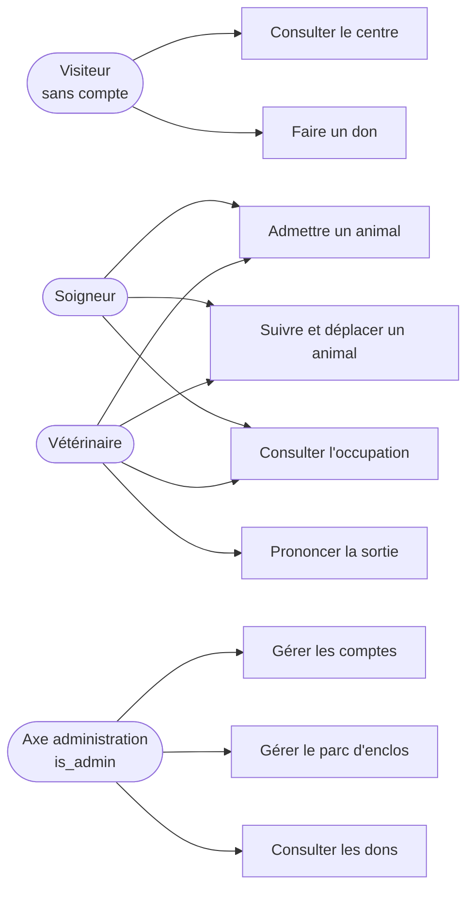
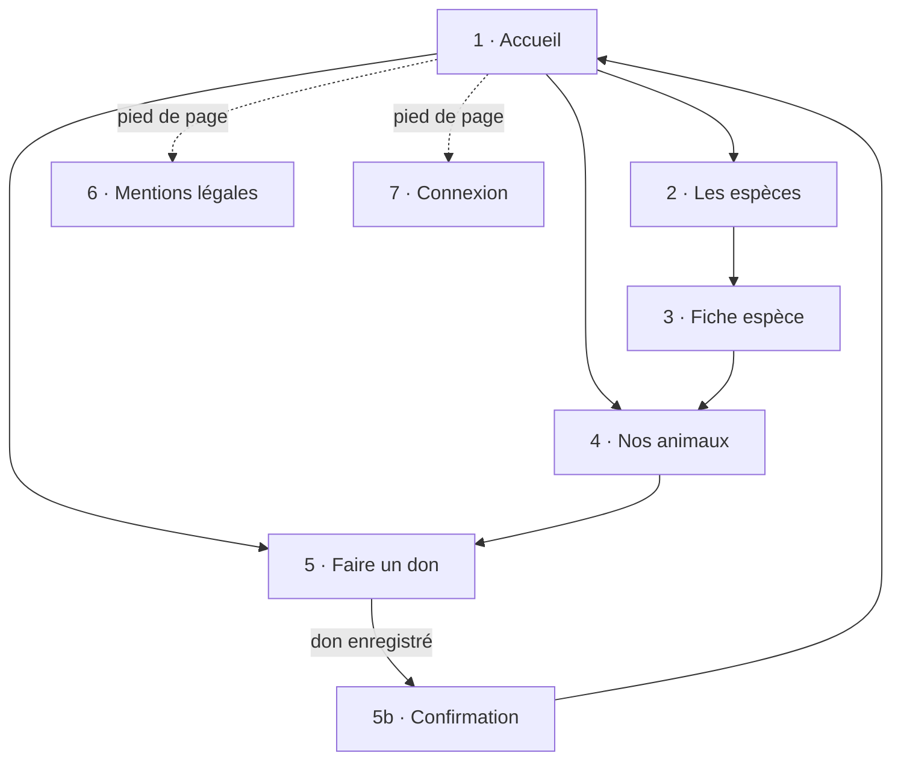
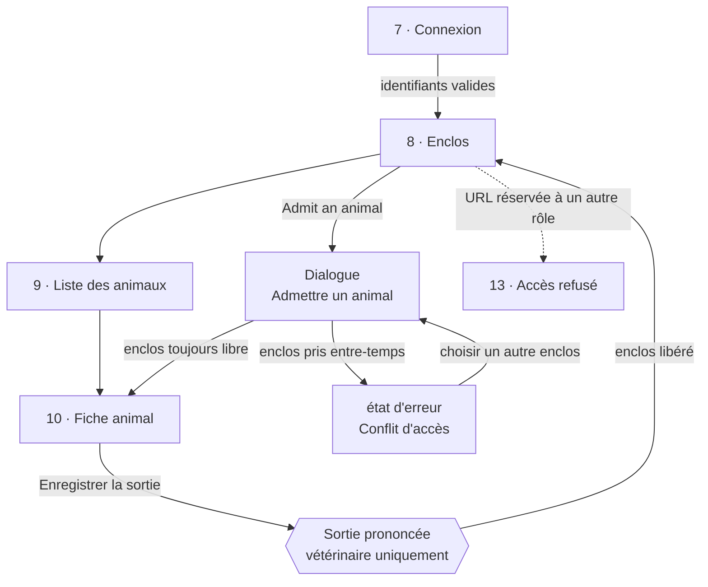
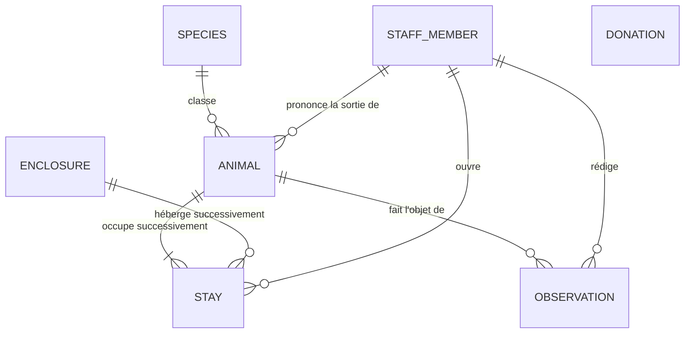

# Dossier de conception — Centre Khulula

| | |
|---|---|
| **Version** | 1.0 — 20 août 2026 |
| **Couvre** | CP 5 — *analyser les besoins et maquetter une application* |
| **Entrée** | `cahier-des-charges.md` v1.5, émis par la maîtrise d'ouvrage |

Ce dossier est la **réponse de la maîtrise d'œuvre** au cahier des charges. Il ne le recopie pas :
le cahier des charges dit *ce qui est demandé*, ce dossier dit *comment nous y répondons*.

**Documents constitutifs.** Chacun est autonome et fait référence sur son sujet.

| Document | Contenu |
|---|---|
| `cahier-des-charges.md` | Le besoin exprimé : périmètre, acteurs, 18 besoins, RG1–RG16 |
| `charte-graphique.md` | Couleurs avec contrastes mesurés, typographie, composants, RGAA |
| `arborescence-ecrans.md` | Les 13 écrans, l'enchaînement, le cycle de vie de l'animal |
| `modele-donnees.md` | MCD, MLD, MPD et la couverture des règles de gestion |
| `maquettes/prototype.html` | Les 13 écrans cliquables |

---

## 1. Démarche de conception

Cinq étapes, dans cet ordre, chacune produisant l'entrée de la suivante.

| Étape | Production | Pourquoi avant la suivante |
|---|---|---|
| 1. Analyse du besoin | Acteurs, limites du système, 18 user stories, 16 règles de gestion | On ne maquette pas ce qu'on n'a pas délimité |
| 2. Maquettage | 13 écrans | Les écrans révèlent les besoins oubliés — c'est ce qui a fait apparaître l'écran 12 et la table `observation` |
| 3. Enchaînement | 4 diagrammes | Un écran isolé ne dit pas s'il est atteignable |
| 4. Charte graphique | Palette, typographie, composants, RGAA | Fige les valeurs avant le code |
| 5. Modèle de données | MCD, MLD, MPD | Dernier, parce qu'il doit porter toutes les règles issues des étapes 1 à 3 |

**Le passage n'est jamais à sens unique.** L'étape 2 a renvoyé à l'étape 1 : en maquettant la
fiche animal, l'historique de suivi (S6) n'avait aucune table pour le stocker, ce qui a ajouté
`observation` au modèle. De même, le cahier des charges annonçait une création de comptes par un
administrateur alors qu'aucun administrateur n'existait — le maquettage l'a révélé, et le modèle
de droits a été repris sur deux axes.

---

## 2. Analyse des besoins

### 2.1 Limites du système

| Dans le système | Hors du système |
|---|---|
| Enclos, animaux, séjours, observations, dons, comptes du personnel | Encaissement des dons, cartographie, envoi d'e-mails, dossier médical détaillé, inscription publique |

Le centre gère un **nombre fini d'enclos**. C'est la contrainte structurante : elle produit RG1
(un animal par enclos), RG2 (pas d'admission sans enclos libre) et le cas de concurrence qui est
la difficulté technique centrale du projet.

### 2.2 Acteurs

Les droits se lisent sur **deux axes indépendants** : le rôle métier (soigneur ou vétérinaire) et
l'indicateur `is_admin`. Un même agent porte les deux. Le vétérinaire se distingue du soigneur par
**une seule action** — prononcer la sortie — mais c'est la seule qui soit irréversible.

Justification du choix en `cahier-des-charges.md` §3.2.

### 2.3 Besoins utilisateur

18 user stories, réparties en quatre groupes. Le détail est en `cahier-des-charges.md` §4.

| Groupe | Réf. | Nombre |
|---|---|---|
| Visiteur | V1 – V6 | 6 |
| Soigneur | S1 – S7 | 7 |
| Vétérinaire | T1, T4 | 2 |
| Administrateur | A1 – A3 | 3 |

T2 (*créer et modifier les fiches espèces*) a été **retiré du périmètre** : le référentiel des
espèces est fixé par l'UICN pour tout le secteur, donc alimenté par migration versionnée et non
par un écran de saisie.

### 2.4 Règles de gestion

16 règles, RG1 à RG16, énoncées en `cahier-des-charges.md` §5. Chacune est portée par un élément
précis du modèle ou du code : la table de correspondance est en `modele-donnees.md` §6.

Les trois qui structurent l'application :

| Règle | Conséquence de conception |
|---|---|
| **RG1** — un seul animal par enclos | Index unique partiel en base, pas un contrôle applicatif |
| **RG3** — le statut d'un enclos est déduit | Un trigger l'écrit ; l'application ne fait que le lire |
| **RG8** — un déplacement est indivisible | Une transaction unique, avec le même conflit d'accès que l'admission |

---

## 3. Maquettes

**13 écrans** : 6 publics, 7 réservés au personnel. Inventaire complet et justification des
regroupements en `arborescence-ecrans.md` §1.

| | |
|---|---|
| **Outil** | Figma pour les maquettes livrées ; un prototype HTML cliquable sert de référence de comportement |
| **Écrans publics** | Accueil, Les espèces, Fiche espèce, Nos animaux, Faire un don, Mentions légales |
| **Écrans du personnel** | Connexion, Enclos, Liste des animaux, Fiche animal, Liste des dons, Comptes du personnel, Accès refusé |

**Réduction de 20 à 13 écrans.** Chaque suppression a retiré une duplication, jamais un besoin :
deux listes qui ne diffèrent que par un filtre sont un écran à onglets, une confirmation est un
second état de la même route, un formulaire est une boîte de dialogue. Les 18 besoins restent
couverts — la couverture se mesure aux besoins servis, pas au nombre de pages.

**Accessibilité (RGAA).** Les règles applicables sont fixées dans `charte-graphique.md` §6 et
vérifiées écran par écran : contrastes AA mesurés par script et non à l'œil, navigation complète
au clavier, indicateur de focus jamais supprimé, aucune information portée par la couleur seule,
étiquettes liées à leur champ. Les cartes animal ne sont pas cliquables et ne doivent donc pas
*paraître* cliquables.

---

## 4. Enchaînement des écrans

Critère CP 5 : *« l'enchaînement des maquettes est formalisé par un schéma »*. Quatre diagrammes
en `arborescence-ecrans.md` : site public, espace personnel, écrans d'administration, cycle de vie
de l'animal.

### 4.1 Site public

### 4.2 Espace personnel

Le **conflit d'accès** n'est pas un écran : c'est l'état d'erreur de la boîte d'admission quand
l'enclos choisi a été pris entre son ouverture et sa soumission. La boîte ne se ferme pas, les
données saisies restent en place, et rien n'a été écrit en base.

---

## 5. Modèle de données

Détail complet — MCD, MLD, MPD, types, contraintes et index — en `modele-donnees.md`.

Sept entités. `STAY` est l'entité pivot : un animal, un enclos, une période. Un séjour dont la
date de fin est vide est un séjour en cours, et c'est de cette seule information que découlent
l'occupation des enclos, la durée de séjour et le taux d'occupation.

`DONATION` n'a **aucune relation** : un don est anonyme et n'est rattaché à personne.

---

## 6. Traçabilité

Chaque besoin est servi par un écran, chaque règle par un élément du modèle.

| Chaîne | Où elle est vérifiée |
|---|---|
| Besoin → écran | `arborescence-ecrans.md` §7 — les 18 besoins couverts par 13 écrans |
| Règle → modèle | `modele-donnees.md` §6 — RG1 à RG16 |
| Écran → charte | `charte-graphique.md` — aucune valeur graphique hors de ce document |

---

## 7. Ce que la conception a délibérément exclu

Les exclusions sont documentées en `cahier-des-charges.md` §2.2. Les trois qui seront discutées :

| Exclusion | Réponse |
|---|---|
| **Aucun paiement réel** | Un don enregistre une intention. Aucun champ de carte, aucun prestataire. Évite les exigences PCI-DSS pour un besoin qui ne les appelle pas. |
| **Aucun écran de gestion des espèces** | Donnée de référence fixée par l'UICN : alimentée par migration versionnée, pour qu'un utilisateur ne puisse pas désynchroniser silencieusement le centre de la classification officielle. |
| **Aucun téléversement de fichier** | Les photos sont des URL vers des images fournies avec l'application. Supprime une surface d'attaque importante. |

**Évolution identifiée, non retenue pour cette version.** Photographier chaque animal accueilli,
depuis sa fiche, aurait une vraie valeur pour les pages publiques et pour les dons. Ce serait un
téléversement complet : validation du type par le contenu, taille limitée, nom de fichier
aléatoire, stockage hors de la racine applicative, volume Docker dédié. Estimé à deux jours pour
un besoin qu'aucune compétence du référentiel n'évalue — l'arbitrage a été rendu en faveur du
dossier professionnel, qui est le livrable noté.
