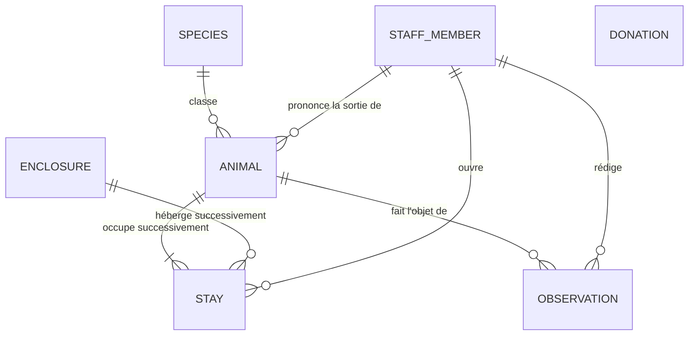

# Modèle de données — Centre Khulula

| | |
|---|---|
| **Version** | 1.1 — 20 août 2026 |
| **Couvre** | CP 7 — *« Le modèle de données est conforme aux règles de gestion »* |
| **Source** | `cahier-des-charges.md` v1.4 |

| Couche | Répond à | Section |
|---|---|---|
| **MCD** | Quelles entités, quelles relations | §2 |
| **MLD** | Quelles tables, quelles colonnes | §4 |
| **MPD** | Quels types PostgreSQL, quelles contraintes | §5 |

---

## 1. Convention de nommage

| Élément | Règle | Exemple |
|---|---|---|
| Langue | **anglais**, comme le code et l'interface | `enclosure` |
| Table | singulier, `snake_case` | `staff_member` |
| Clé primaire | `id` | `animal.id` |
| Clé étrangère | `<table>_id` | `animal.species_id` |
| Date | suffixe `_at` | `admitted_at` |
| Booléen | préfixe `is_` | `is_admin` |

Le cahier des charges nomme les tables en français ; le choix de l'anglais lui est postérieur et
vaut pour toute la base. La table `utilisateur` s'appelle `staff_member` et non `user`, parce que
`user` est un mot réservé de PostgreSQL.

| Cahier des charges | Table |
|---|---|
| `utilisateur` | `staff_member` |
| `espece` | `species` |
| `enclos` | `enclosure` |
| `animal` | `animal` |
| `sejour` | `stay` |
| `don` | `donation` |
| *(ajoutée)* | `observation` |

`observation` ne figurait pas dans la liste initiale : l'écran 10 affiche un historique de suivi
(besoin S6) que rien ne stockait.

---

## 2. MCD — modèle conceptuel



| Relation | Lecture | Règle |
|---|---|---|
| `SPECIES` → `ANIMAL` | Un animal appartient à une seule espèce. | V2 |
| `ANIMAL` → `STAY` | Un animal a au moins un séjour, plusieurs s'il a été déplacé. | RG8 |
| `ENCLOSURE` → `STAY` | Un enclos héberge des séjours **successifs**, jamais simultanés. | **RG1** |
| `ANIMAL` → `OBSERVATION` | Une observation porte sur un seul animal. | S6 |
| `STAFF_MEMBER` → `OBSERVATION` | Une observation a un auteur. | RG12 |
| `STAFF_MEMBER` → `STAY` | Un séjour a un auteur. | S3 |
| `STAFF_MEMBER` → `ANIMAL` | Un animal a au plus une sortie, prononcée par un vétérinaire. | RG5, RG6 |
| `DONATION` | **Aucune relation** : un don n'est rattaché à personne. | **RG10** |

---

## 3. Trois choix de conception

Ce sont les trois seules décisions du modèle qui ne vont pas de soi.

### 3.1 L'enclos n'est pas une colonne de l'animal

Mettre `enclosure_id` dans `animal` serait plus court, mais chaque déplacement écraserait l'enclos
précédent : l'animal perdrait son historique, que RG8 demande justement de conserver. L'enclos
passe donc par `stay`.

### 3.2 `stay.ended_at IS NULL` veut dire « séjour en cours »

De cette seule information découlent l'occupation d'un enclos (RG3), la durée de séjour et le taux
d'occupation (T4), et l'unicité d'occupant (RG1). Aucune colonne « en cours » n'est ajoutée : deux
colonnes disant la même chose finissent par se contredire.

### 3.3 `observation` ne stocke que les observations

L'admission, les déplacements et la sortie sont déjà décrits par `stay` et par `animal` ; les
journaliser une seconde fois créerait deux versions du même fait. La frise chronologique de
l'écran 10 est construite par le service, en fusionnant les observations et les séjours triés par
date.

---

## 4. MLD — modèle logique

Notation : <u>clé primaire</u>, *#clé étrangère*, `?` = peut être vide.

**staff_member** (<u>id</u>, full_name, email, password_hash, role, is_admin, is_active, created_at)

`email` est unique et sert d'identifiant de connexion. `password_hash` est haché avec argon2,
jamais en clair. `role` vaut `keeper` ou `veterinarian` ; `is_admin` est le second axe de droits
(§3.2 du cahier des charges) et n'est jamais accordé depuis l'interface (RG13). Un compte se
désactive avec `is_active`, il ne se supprime pas (RG12).

**species** (<u>id</u>, common_name, scientific_name, iucn_status, habitat, diet, activity, description, photo_url)

`scientific_name` est unique. Aucune colonne de comptage : « soignés » et « relâchés » se
calculent depuis `animal`, sinon les compteurs se désynchroniseraient.

**enclosure** (<u>id</u>, code, type, notes`?`, is_under_maintenance, status)

`code` est unique (`E-01`…). `is_under_maintenance` est saisi par un administrateur ; `status`
n'est jamais saisi — voir §5.4.

**animal** (<u>id</u>, name, *#species_id*, sex, age_class, found_near`?`, admission_reason, status, admitted_at, outcome_at`?`, outcome_note`?`, *#outcome_by_id*`?`)

`status` suit le cycle de vie RG4. `found_near` est un nom de lieu, jamais des coordonnées GPS, et
n'est jamais affiché publiquement (RG11). Les trois colonnes de sortie restent vides tant qu'aucune
sortie n'est prononcée, et sont remplies ensemble (RG5, RG6).

**stay** (<u>id</u>, *#animal_id*, *#enclosure_id*, started_at, ended_at`?`, move_reason`?`, *#opened_by_id*)

`move_reason` n'est rempli que si le séjour a été ouvert par un déplacement, pas par l'admission.

**observation** (<u>id</u>, *#animal_id*, *#author_id*, observed_at, body, status_after`?`)

`status_after` n'est rempli que si l'observation fait changer l'animal de statut. Table en **ajout
seul** : ni modification, ni suppression.

**donation** (<u>id</u>, amount, donor_name`?`, donor_email`?`, message`?`, consent_given, created_at)

Aucune clé étrangère (RG10). Un don anonyme laisse les trois champs du donateur vides.

### 4.1 Le nom n'identifie pas l'animal

L'identifiant est `animal.id`, attribué à l'admission et jamais modifié. Le nom est obligatoire
mais **non unique** : deux servals peuvent s'appeler Nala. Aucune requête ni aucune URL ne s'appuie
sur le nom.

Le nom est obligatoire parce qu'aucun écran ne permet de le renseigner après l'admission : un
animal admis sans nom resterait sans nom.

### 4.2 Les énumérations

| Type | Valeurs |
|---|---|
| `staff_role` | `keeper`, `veterinarian` |
| `animal_status` | `admitted`, `in_care`, `recovering`, `released`, `deceased` |
| `enclosure_status` | `free`, `occupied`, `maintenance` |
| `enclosure_type` | `small_mammal`, `large_mammal`, `aviary`, `reptile` |
| `iucn_status` | `least_concern`, `near_threatened`, `vulnerable`, `endangered`, `critically_endangered` |
| `sex` | `male`, `female`, `unknown` |
| `age_class` | `juvenile`, `subadult`, `adult`, `unknown` |

Une énumération est vérifiée par la base : `'Recovring'` mal orthographié est rejeté, pas
enregistré.

---

## 5. MPD — modèle physique (PostgreSQL 16)

### 5.1 Types

| Usage | Type | Pourquoi |
|---|---|---|
| Clé primaire | entier auto-incrémenté | Prisma : `@default(autoincrement())` |
| Texte court | `VARCHAR(n)` | la longueur maximale est une contrainte de la base |
| Texte long | `TEXT` | description d'espèce, corps d'observation |
| Date et heure | `TIMESTAMPTZ` | stocke le fuseau : le centre est en Afrique du Sud, le serveur peut être ailleurs |
| Montant | `NUMERIC(7,2)` | **jamais `FLOAT`** : les flottants arrondissent |
| Énumération | type `ENUM` | contrôle assuré par la base (§4.2) |
| Booléen | `BOOLEAN NOT NULL` avec valeur par défaut | jamais de booléen vide, qui créerait un troisième état |

### 5.2 Contraintes

| Contrainte | Table | Règle |
|---|---|---|
| unicité | `staff_member.email`, `species.scientific_name`, `enclosure.code` | — |
| `chk_donation_amount` | `donation` | `amount > 0 AND amount <= 10000` — **RG9** |
| `chk_stay_dates` | `stay` | `ended_at IS NULL OR ended_at >= started_at` |

Les règles qui portent sur plusieurs colonnes à la fois — cohérence des trois colonnes de sortie,
transitions de statut autorisées — sont vérifiées par Zod et par la couche service, en un seul
endroit par ressource.

### 5.3 Index

| Index | Rôle |
|---|---|
| `uq_stay_current_enclosure` — index unique **partiel** sur `stay(enclosure_id)` limité aux lignes où `ended_at IS NULL` | **RG1** : un enclos ne peut pas avoir deux séjours ouverts |
| index sur chaque clé étrangère | PostgreSQL ne les crée pas automatiquement |
| `idx_animal_status` | filtrage des listes publiques (écran 4) |

L'index unique partiel est la vraie garantie de RG1 : un contrôle applicatif se contourne par un
bug ou par deux requêtes simultanées, un index unique non. C'est lui qui transforme le conflit
d'accès de l'écran 8 en erreur propre plutôt qu'en double occupation.

### 5.4 Le statut d'un enclos

Deux règles se croisent :

| Règle | Ce qu'elle impose |
|---|---|
| **RG3** | Le statut est déduit des séjours en cours, jamais saisi. |
| **RG16** | Il existe un statut `maintenance`, qu'aucun séjour ne peut produire. |

Le statut est donc à la fois déduit et décidé. Les deux sont séparés en deux colonnes :

| Colonne | Nature | Qui l'écrit |
|---|---|---|
| `is_under_maintenance` | décision | un administrateur, et seulement si l'enclos est libre (RG16) |
| `status` | conséquence | le trigger, jamais l'application |

Le trigger applique une règle unique :

```
si is_under_maintenance                         -> 'maintenance'
sinon s'il existe un séjour avec ended_at NULL  -> 'occupied'
sinon                                           -> 'free'
```

Il se déclenche à chaque écriture dans `stay` et à chaque changement de `is_under_maintenance`.
`status` est stocké plutôt que recalculé parce qu'il est lu en permanence et écrit rarement ; le
trigger garantit qu'il ne peut pas mentir.

### 5.5 Suppression

**Le modèle ne supprime rien** : un compte se désactive (RG12), un enclos et un animal conservent
leur historique. Toutes les clés étrangères sont en `ON DELETE RESTRICT`, pour qu'une suppression
accidentelle devienne une erreur plutôt qu'une perte de données.

Exception RGPD : une demande de suppression sur un don **anonymise** la ligne — `donor_name` et
`donor_email` vidés — sans la supprimer. Le montant reste dans la comptabilité, la donnée
personnelle disparaît.

### 5.6 Les deux comptes du SGBD

Exigence §6.1 du cahier des charges.

| Compte | Usage | Droits |
|---|---|---|
| `khulula_admin` | migrations Prisma, sauvegarde et restauration | tous |
| `khulula_app` | le compte utilisé par l'API | ci-dessous |

| Table | Droits de `khulula_app` |
|---|---|
| `species` | `SELECT` seulement — donnée de référence, modifiée par migration |
| `observation` | `SELECT`, `INSERT` — ni modification ni suppression : l'ajout seul devient une garantie du SGBD |
| les autres | `SELECT`, `INSERT`, `UPDATE` |
| **toutes** | **`DELETE` refusé partout** |

C'est l'application du principe de moindre privilège : même si l'API était compromise par une
injection SQL, le compte qu'elle utilise ne *peut pas* effacer une observation ni réécrire
l'historique. La règle n'est pas seulement écrite dans le code, elle est retirée des droits.

### 5.7 Ce que Prisma ne génère pas

Prisma produit les tables, les clés et les relations. Le reste est du SQL écrit à la main dans les
migrations (`npx prisma migrate dev --create-only`) :

- le trigger du statut d'enclos (§5.4) ;
- l'index unique partiel (§5.3) ;
- les fonctions stockées « taux d'occupation » et « durée moyenne de séjour » (T4) ;
- la création des deux comptes et leurs droits (§5.6).

---

## 6. Couverture des règles de gestion

| Règle | Portée par |
|---|---|
| RG1 | index unique partiel sur `stay` (§5.3) |
| RG2 | transaction d'admission avec verrou de ligne |
| RG3 | trigger sur `enclosure.status` (§5.4) |
| RG4, RG5 | énumération `animal_status` + contrôle des transitions en service |
| RG6 | `animal.outcome_by_id` + contrôle du rôle côté serveur |
| RG7 | le trigger repasse l'enclos à `free` quand `stay.ended_at` est rempli |
| RG8 | deux écritures dans `stay` en une seule transaction |
| RG9 | `chk_donation_amount` |
| RG10, RG11 | aucune clé étrangère sur `donation` ; champs donateur facultatifs |
| RG12 | `staff_member.is_active` — aucune suppression |
| RG13, RG14 | `is_admin` hors interface + contrôle en service |
| RG15 | réinitialisation par un administrateur ; aucune table de jeton |
| RG16 | `is_under_maintenance` refusé si un séjour est en cours |
